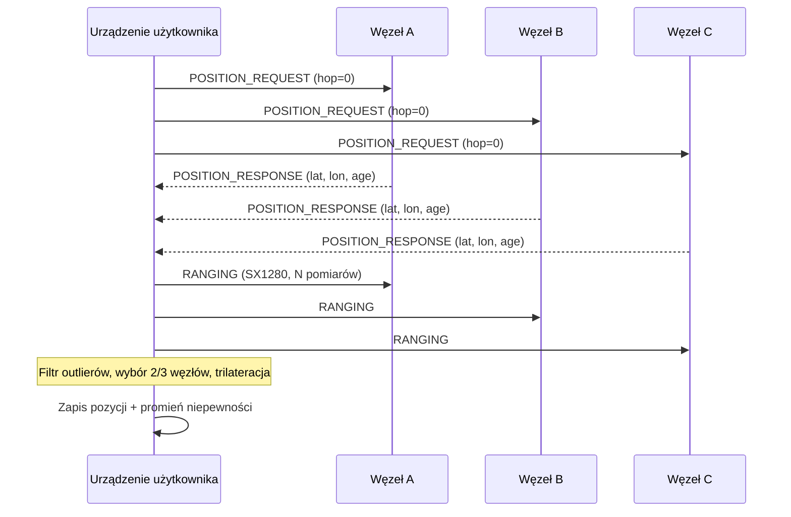
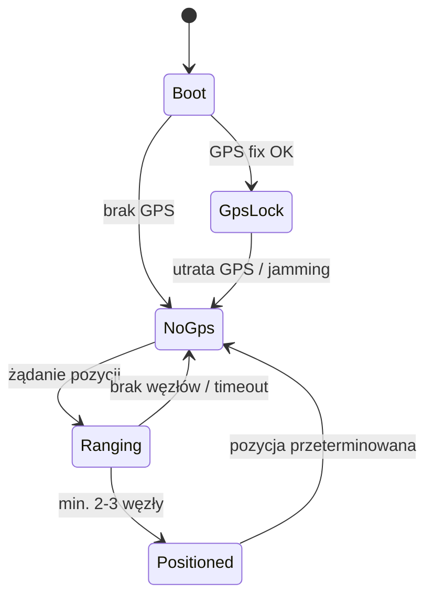
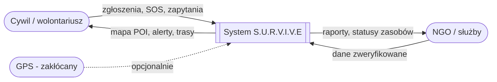
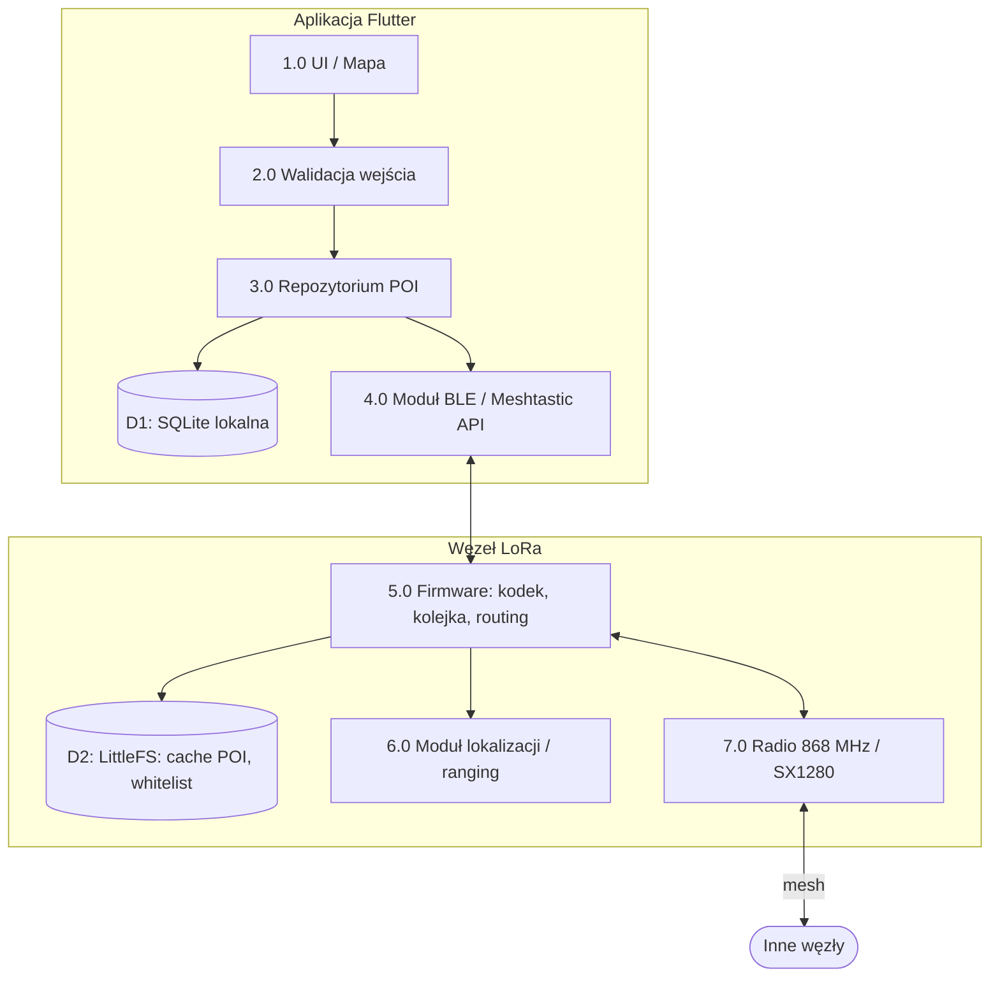
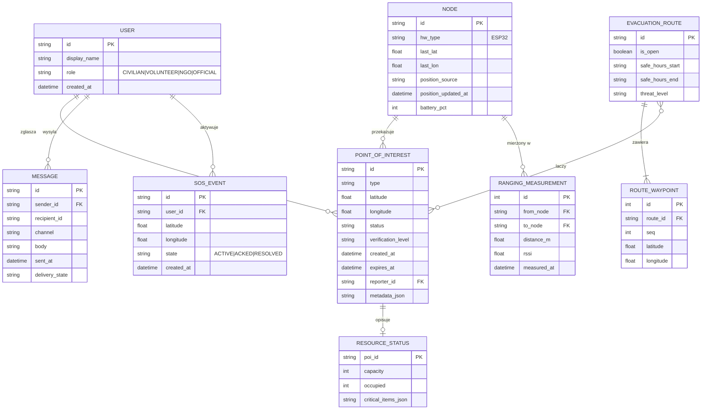
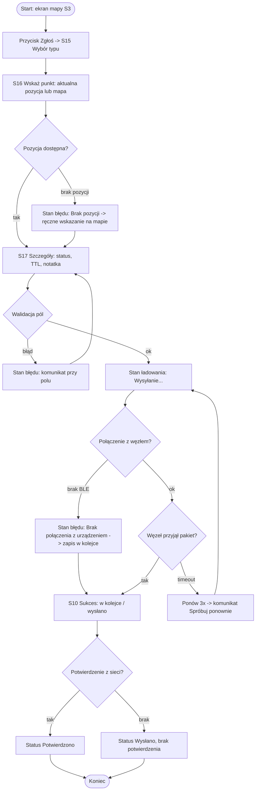

# S.U.R.V.I.V.E

|**S**|Stay calm|
|---|---|
|**U**|Understand your situation|
|**R**|Respond with reason|
|**V**|Value your resources|
|**I**|Improvise when needed|
|**V**|Visualize success|
|**E**|Endure everything|

**Nazwa grupy:** Grupa 6D **Osoby:** Adam Podymniak, Karolina Rutkowska, Bartosz Sikora
## Tematyka projektu

Tanie urządzenie oparte na architekturze LoRa (Meshtastic) oraz własny system określania lokalizacji i przesyłania danych o zagrożeniach, punktach sanitarnych, punktach ewakuacji itp. w strefach wojennych, gdzie konwencjonalne sygnały (GPS, WiFi) są zakłócane. Projekt jest przeznaczony dla cywilów i służb humanitarnych, aby mogli porozumiewać się między sobą i przekazywać informacje o stanie szpitali polowych, magazynów zasobów, liczbie osób itp.

## Technologie

|Warstwa|Technologia|
|---|---|
|Aplikacja mobilna|Flutter + `osm_flutter_plugin` (mapy OSM offline), `drift`/SQLite, Riverpod lub BLoC|
|Tanie urządzenie|ESP32-WROOM + SX1280 (2,4 GHz, sprzętowy ranging) + SX126x/SX127x (868 MHz, transport danych) + Radio LoRa|
|Firmware|Fork Meshtastic z nową funkcjonalnością (C/C++, FreeRTOS, nanopb)|

---

# 1. Działanie aplikacji (krok po kroku)

## 1.1 Ustalanie lokalizacji bez GPS (w tym PoC ranging)

1. **Zapamiętanie pozycji.** Węzły stacjonarne, które utraciły GPS, utrzymują ostatnią znaną lokalizację i ją zwracają. Ponieważ są statyczne, zapisana wartość pozostaje poprawna. Każdy węzeł przechowuje też flagę `positionSource` (`GPS_FIX`, `GPS_STALE`, `MANUAL`, `TRILATERATED`) oraz `positionAge`.
2. **Zapytanie o koordynaty.** Urządzenie rozgłasza `POSITION_REQUEST` do węzłów w zasięgu bezpośrednim (bez przeskoków) i zbiera odpowiedzi `POSITION_RESPONSE` (koordynaty + `positionSource` + `positionAge`).
3. **Pomiar dystansu (PoC ranging).** Do każdego z odpowiadających węzłów wykonywany jest "ranging" na SX1280. Dokonywanych jest kilka pomiarów na węzeł (np. 8-16) i odrzucenie wartości odstających (mediana + MAD). Dystans: `d = c · (t_roundtrip − t_processing) / 2` (może ulec zmianie przy testowaniu)
4. **Wybór optymalnych 2/3 węzłów.** Algorytm ocenia kandydatów według kryteriów:
    - bliskość (mniejszy dystans = mniejszy błąd bezwzględny),
    - geometria (kąt między kierunkami do węzłów jak najbliższy 90° dla 2 węzłów lub trójkąt jak najbardziej „rozłożony" dla 3),
    - jakość danych (świeża pozycja, `GPS_FIX` > `GPS_STALE`, niskie odchylenie pomiarów). Wynik to ranking `score = w1·(1/d) + w2·geometry + w3·quality`, a następnie wybór najlepszej podgrupy (przy 5-6 kandydatach to tylko kilkanaście kombinacji, więc nie ma problemu wydajnościowego).
5. **Obliczenie lokalizacji.**
    - **3 węzły:** trilateracja (liniowy układ równań po odjęciu równań okręgów, w razie nadmiarowości metoda najmniejszych kwadratów).
    - **2 węzły:** dają dwa rozwiązania (punkty przecięcia okręgów). Wybierane jest to zgodne z ostatnią znaną pozycją lub kierunkiem ruchu, a wynik jest oznaczany jako `LOW_CONFIDENCE`.
    - Współrzędne geograficzne są przeliczane do lokalnego układu płaskiego (ENU / równoprostokątne), a po obliczeniach z powrotem na WGS84.
    - Wynik zawiera szacowany błąd (promień niepewności), który wyświetla aplikacja jako okrąg na mapie.



## 1.2 Zabezpieczenie komunikacji

1. W wypadku użycia zakłócaczy (jammerów) słaby sygnał GPS zostanie łatwo wyeliminowany.
2. W wypadku użycia zakłócaczy o większej mocy może zostać odcięty dostęp do WiFi.
3. LoRa działająca na 868 MHz z modulacją rozproszonego widma (CSS, chirp) jest znacznie odporniejsza na zakłócenia, dlatego komunikacja między urządzeniami może pozostać nienaruszona. Meshtastic/MeshCore mają pełne systemy wymiany wiadomości tekstowych (publiczne/prywatne).

## 1.3 Enkodowanie / dekodowanie dla optymalizacji przesyłu

LoRa ma mały payload (ok. 237 B w Meshtastic) i niski duty cycle (868 MHz w UE: 1% lub 10% zależnie od podpasma). Każdy bajt zmniejsza czas w eterze, więc wiadomość o punkcie musi być binarna i zwięzła.

**Założenia kodeka (`PoiCodec`):**

- Protobuf (nanopb) dla zgodności z Meshtastic, a w ramach niego **własne pola upakowane bitowo** dla najczęstszych zdarzeń.
- Pozycja jako `int32` w jednostkach 1e-7 stopnia (jak w Meshtastic).
- Czas jako `uint32` minut od epoki ustalonej w projekcie (zamiast sekund Unix).
- TTL jako `uint8` w jednostkach 5 minut (0–21 godzin) z kodem specjalnym `0xFF` = bez wygaśnięcia.

**Przykładowy układ pakietu POI (cel: ≤ 24 B):**

|Pole|Bity|Opis|
|---|---|---|
|`version`|3|wersja formatu|
|`type`|5|32 typy POI (`PointOfInterestType`)|
|`status`|2|`ACTIVE / AT_CAPACITY / DESTROYED / UNKNOWN`|
|`verification`|2|`OFFICIAL / NGO_VERIFIED / CROWDSOURCED / UNVERIFIED`|
|`reserved`|4|zapas|
|`id`|32|skrót (hash) identyfikatora|
|`lat`, `lon`|2×32|pozycja bezwzględna|
|`timestamp`|32|minuty od epoki projektu|
|`ttl`|8|jednostki po 5 min|
|`metaMask` + `meta`|8 + n|opcjonalne pola (pojemność, liczba osób, lek itd.)|
|`crc16`|16|kontrola spójności|

**Dodatkowe optymalizacje:**

- Deduplikacja po `id` + `timestamp` (flooding w mesh nie powinien rozsyłać tej samej informacji wielokrotnie).
- Priorytety: `SOS_BEACON` > zagrożenia > ewakuacja > zasoby > reszta (kolejka priorytetowa w nadawaniu).

## 1.4 Wymiana P2P i zaufanie

- Wymiana P2P (Peer-to-Peer) z możliwością wybierania węzłów zaufanych i usuwania węzłów zakłócających.
- **Lista zaufania (whitelist / blacklist)** przechowywana lokalnie.
- **Automatyczne ignorowanie** węzła, który przekracza próg spamu (np. > N pakietów/min) lub nadaje niepoprawne pakiety. Użytkownik może to cofnąć ręcznie.

## 1.5 Automat stanów urządzenia



---

# 2. Dane

## 2.1 Zakres danych (kategorie)

### Infrastruktura medyczna i zdrowotna

- **Szpitale polowe i przychodnie:** status operacyjny, możliwości leczenia urazów i limity miejsc.
- **Apteki i składy medyczne:** dostępność krytycznych leków (insulina, antybiotyki, stazy taktyczne, jod).

### Zagrożenia i bezpieczeństwo

- **Niewybuchy (UXO) i pola minowe:** znane lub podejrzewane niewybuchy, miny lądowe i zaminowana infrastruktura.
- **Strefy aktywnych walk:** aktualne linie frontu, obszary potyczek i strefy niedawnych uderzeń artylerii/lotnictwa.
- **Aleje snajperów i wrogie punkty kontrolne:** korytarze o wysokim ryzyku i wojskowe blokady drogowe.

### Ewakuacja i bezpieczne przemieszczanie się

- **Korytarze humanitarne:** oficjalne bezpieczne trasy, w tym uzgodnione okna zawieszenia broni i godziny otwarcia/zamknięcia.
- **Punkty zbiórki do ewakuacji:** wyznaczone miejsca zbiórek dla ewakuacji przez organizacje pozarządowe lub rząd.
- **Schrony:** schrony przeciwbombowe, wzmocnione piwnice, podziemne stacje metra i wyznaczone bezpieczne strefy ONZ.

### Zasoby niezbędne

- **Punkty poboru wody (WASH):** studnie z wodą pitną, beczkowozy i punkty oczyszczania wody.

### Zgłaszanie incydentów i metadane od społeczności

- **Tagi czasu życia (TTL):** dane o wygaśnięciu dla tymczasowych zagrożeń (np. usunięcie blokady drogowej lub przesunięcie linii frontu).
- **Poziomy weryfikacji:** poziomy zaufania odróżniające zweryfikowane dane NGO, oficjalne alerty rządowe i niezweryfikowane zgłoszenia społeczności.
- **Sygnały SOS:** aktywacje przycisku paniki w czasie rzeczywistym od użytkowników potrzebujących natychmiastowej pomocy.

## 2.2 Model danych (podglądowo)

```c++
type VerificationLevel = 'OFFICIAL' | 'NGO_VERIFIED' | 'CROWDSOURCED' | 'UNVERIFIED';

type PointOfInterestType =
  | 'FIELD_HOSPITAL'
  | 'PHARMACY'
  | 'MINEFIELD'
  | 'UXO'
  | 'COMBAT_ZONE'
  | 'CHECKPOINT'
  | 'EVACUATION_CORRIDOR'
  | 'ASSEMBLY_POINT'
  | 'BOMB_SHELTER'
  | 'WATER_POINT'
  | 'SOS_BEACON';

type OperationalStatus = 'ACTIVE' | 'AT_CAPACITY' | 'DESTROYED' | 'UNKNOWN';

interface Coordinates {
  latitude: number;
  longitude: number;
}

interface PointOfInterest {
  id: string;
  type: PointOfInterestType;
  coordinates: Coordinates;
  status: OperationalStatus;
  verificationLevel: VerificationLevel;
  timestamp: string;
  expiresAt?: string;
  metadata: Record<string, string | number | boolean>;
}

interface EvacuationRoute {
  id: string;
  waypoints: Coordinates[];
  isOpen: boolean;
  safeHoursStart?: string;
  safeHoursEnd?: string;
  threatLevel: 'LOW' | 'MEDIUM' | 'HIGH';
}
```

## 2.3 Data Flow Diagram (DFD)

**Poziom 0 (kontekstowy)**



**Poziom 1**



## 2.4 Persistent storage

Dane są przechowywane na dwóch poziomach. Najważniejszy jest poziom lokalny, bo zakłada się brak internetu.

|Poziom|Technologia|Zawartość|
|---|---|---|
|**Węzeł (firmware)**|LittleFS na flash / NVS|cache POI (ring buffer z wygasaniem po TTL), whitelist/blacklist, ostatnia pozycja|
|**Telefon**|SQLite (`drift`) + pliki kafelków OSM offline|pełna lokalna baza POI, historia wiadomości, ustawienia, kolejka do wysłania|

**Strategia synchronizacji:** _offline-first_. Rekordy mają `id` + `timestamp` + `version`, a konflikty rozwiązuje reguła „najnowszy wygrywa z uwzględnieniem poziomu weryfikacji" (`OFFICIAL` nadpisuje `CROWDSOURCED` niezależnie od czasu, chyba że wygasł TTL).

## 2.5 Diagram ERD



## 2.6 Implementacja zapisu i odczytu danych

**Wzorzec repozytorium (Dart):**

```dart
abstract class PoiRepository {
  Future<void> upsert(PointOfInterest poi);
  Future<PointOfInterest?> getById(String id);
  Stream<List<PointOfInterest>> watchInBounds(LatLngBounds bounds, {Set<PoiType>? types});
  Future<int> purgeExpired(DateTime now);
}

class DriftPoiRepository implements PoiRepository {
  DriftPoiRepository(this._db);
  final AppDatabase _db;

  @override
  Future<void> upsert(PointOfInterest poi) async {
    final existing = await getById(poi.id);
    if (existing != null && !poi.shouldReplace(existing)) return; // reguła konfliktów
    await _db.into(_db.pois).insertOnConflictUpdate(poi.toCompanion());
  }

  @override
  Future<int> purgeExpired(DateTime now) =>
      (_db.delete(_db.pois)..where((t) => t.expiresAt.isSmallerThanValue(now))).go();
}
```

**Firmware (C++), zapis do cache na flash:**

- ring buffer rekordów o stałym rozmiarze w LittleFS,
- zapis z CRC16 i numerem sekwencji (odporność na zanik zasilania),
- okresowe czyszczenie rekordów po `expiresAt`.

## 2.7 Walidacja danych wejściowych

| Pole                           | Reguła                                                            | Działanie przy błędzie                                |
| ------------------------------ | ----------------------------------------------------------------- | ----------------------------------------------------- |
| `latitude`                     | −90 ≤ x ≤ 90, liczba skończona                                    | odrzucenie + log `WARN`                               |
| `longitude`                    | −180 ≤ x ≤ 180, liczba skończona                                  | odrzucenie + log `WARN`                               |
| `type`                         | wartość z enuma                                                   | odrzucenie (nieznany typ → `UNKNOWN`, nie propagować) |
| `status` / `verificationLevel` | wartość z enuma                                                   | obniżenie do `UNVERIFIED`                             |
| `timestamp`                    | nie dalej niż np. 10 min w przyszłość i nie starszy niż np. 7 dni | odrzucenie                                            |
| `expiresAt`                    | późniejszy niż `timestamp`, maks. np. 30 dni                      | przycięcie do maksimum                                |
| `metadata`                     | maks. liczba kluczy i długość wartości, brak znaków sterujących   | odrzucenie nadmiarowych pól                           |
| tekst wiadomości               | maks. długość (np. 200 znaków), normalizacja UTF-8                | obcięcie / odrzucenie                                 |
| pakiet radiowy                 | poprawny CRC, długość ≤ limit, wersja obsługiwana                 | odrzucenie bez parsowania dalej                       |
| dystans z ranging              | ≥ 0 i ≤ maks. zasięg radia                                        | odrzucenie pomiaru jako outlier                       |

Walidacja odbywa się **dwukrotnie**: w UI (szybka informacja zwrotna) oraz w warstwie domenowej/firmware (nie wolno ufać danym z eteru ani z aplikacji).

---

# 3. Testowanie

Plan testów obejmuje cztery poziomy.

## 3.1 Testy jednostkowe (bez zależności)

**Narzędzia:** Unity (firmware, kompilacja natywna na PC, bez sprzętu), `flutter_test` + `mocktail` (aplikacja). Każda jednostka testowana w izolacji, zależności zastąpione atrapami (mock).

|Jednostka|Scenariusz|Oczekiwany wynik|
|---|---|---|
|`Trilateration.solve`|3 węzły o znanych pozycjach, dokładne dystanse|pozycja zgodna z prawdziwą (błąd < 0,01 m)|
|`Trilateration.solve`|dystanse z szumem ±5 m|błąd pozycji w granicach tolerancji, zwrócony promień niepewności > 0|
|`NodeSelector.pick`|lista 6 węzłów o różnych kątach i dystansach|wybrane są węzły o najlepszym `score` (bez błędów zaokrągleń)|
|`NodeSelector.pick`|zestaw o bardzo niskim kącie (węzły niemal współliniowe)|niski `geometry score`, ostrzeżenie `LOW_CONFIDENCE`|
|`NodeSelector.pick`|zestaw o kącie bliskim 90°|najwyższy `geometry score`|
|`RangingMath.distance`|czasy reakcji 0 / typowe / bardzo duże|poprawne odległości, brak przepełnień (overflow), brak wartości ujemnych|
|`OutlierFilter`|seria pomiarów z jednym skrajnym|skrajny pomiar odrzucony (mediana + MAD)|
|`PoiCodec.encode/decode`|round-trip dla każdego typu POI|`decode(encode(x)) == x`, rozmiar ≤ 24 B|
|`PoiCodec.decode`|pakiet z błędnym CRC|wyjątek `CrcMismatch`, brak zmian stanu|
|`TtlPolicy.isExpired`|granice czasu (dokładnie TTL, TTL+1)|poprawny wynik na granicy|
|`TrustManager`|nadawca przekracza limit pakietów/min|węzeł oznaczony jako ignorowany|
|`TrustManager`|ręczne cofnięcie blokady|węzeł znów akceptowany|
|`PoiValidator`|współrzędne poza zakresem, NaN, nieznany typ|odrzucenie z odpowiednim kodem błędu|
|`ConflictResolver`|`OFFICIAL` vs `CROWDSOURCED`, nowszy i starszy|wygrywa wyższy poziom weryfikacji|

## 3.2 Testy komponentów (integracyjne)

|Komponenty|Scenariusz|Oczekiwany wynik|
|---|---|---|
|`PoiCodec` + `RadioQueue` + `Dedup`|wiele pakietów z duplikatami|tylko unikalne trafiają do nadawania|
|Aplikacja ↔ węzeł przez BLE (mock GATT)|wysłanie POI z aplikacji|pakiet w kolejce węzła, potwierdzenie w UI|
|`PoiRepository` + SQLite (in-memory)|upsert, odczyt w obszarze mapy, wygasanie po TTL|poprawne dane i brak wygasłych rekordów|
|`TrustManager` + `RadioRx`|węzeł-spamer wśród prawidłowych|spam ignorowany, pozostały ruch niezakłócony|
|Moduł mapy (`osm_flutter_plugin`) + repozytorium|dodanie POI|marker pojawia się na mapie, aktualizuje się strumień|

## 3.3 Testy wydajności (niefunkcjonalne)

|Metryka|Scenariusz|Cel / próg|
|---|---|---|
|Czas ranging + obliczenie pozycji|6 węzłów w zasięgu|pozycja w ≤ 5 s|
|Rozmiar pakietu|1000 losowych POI|średnio ≤ 24 B, maks. ≤ 100 B|
|Zużycie pamięci RAM / flash|pełny cache POI (np. 500 rekordów)|RAM w limicie ESP32, brak wycieków (heap przed/po)|
|Czas odczytu z bazy w aplikacji|10 000 POI, zapytanie po obszarze|≤ 100 ms (z indeksem przestrzennym)|
|Płynność mapy|2 000 markerów (klastrowanie)|≥ 30 FPS na średnim telefonie|

## 3.4 Testy akceptacyjne UAT (z użyciem UI)

Testy wykonują osoby spoza zespołu implementacyjnego (np. koledzy z roku, wolontariusze) według scenariuszy odpowiadających przypadkom użycia z sekcji 10. Sprzęt: 3–5 węzłów + 2–3 telefony.

|Scenariusz biznesowy|Kroki|Kryterium akceptacji|
|---|---|---|
|Ustalenie pozycji bez GPS|wyłączenie GPS, uruchomienie aplikacji, „Gdzie jestem?"|pozycja na mapie z promieniem niepewności w ≤ 10 s|
|Zgłoszenie pola minowego|wybór typu, wskazanie punktu, TTL, wysłanie|punkt widoczny na drugim telefonie w ≤ 30 s|
|Aktualizacja stanu szpitala polowego|koordynator zmienia miejsca z „ACTIVE" na „AT_CAPACITY"|zmiana widoczna u wszystkich użytkowników, ikona zmienia kolor|
|Planowanie ewakuacji|użytkownik wybiera trasę z korytarza humanitarnego, widzi godziny bezpieczne|trasa wyświetla się z poziomem zagrożenia i oknem czasowym|
|SOS|przytrzymanie przycisku SOS 3 s|alert u wszystkich w zasięgu, potwierdzenie (ACK) widoczne dla nadawcy|
|Zarządzanie zaufaniem|użytkownik blokuje węzeł-spamer|wiadomości od niego znikają, ruch normalny|

---

# 4. Bazy danych

Szczegółowe diagramy (DFD, ERD) i implementacja znajdują się w sekcji **2** (2.3–2.7). Podsumowanie:

- **Węzeł:** LittleFS/NVS (cache POI z TTL, whitelist), rekordy odporne na zanik zasilania.
- **Telefon:** SQLite przez `drift`, indeks po `(latitude, longitude)` i `expires_at`, kafelki map offline na karcie/pamięci.
- **Zasady:** offline-first, minimalizacja danych osobowych (anonimowe identyfikatory zamiast imion).
- **Walidacja:** podwójna (UI + warstwa domenowa/firmware), zgodnie z tabelą w 2.7.

---

# 5. UI/UX

## 5.1 Persony

|                         |**Maria, 34 l., cywil**|**Dr Marek, 45 l., lekarz w szpitalu polowym**|
|---|---|---|
| Cel                     |bezpieczne dotarcie do punktu ewakuacji|aktualizacja stanu miejsc i leków oraz wezwanie dostaw|
| Kontekst                |stres, słaba bateria, brak internetu|ręce zajęte, mało czasu, rękawice|
| Umiejętności techniczne |podstawowe|średnie|
| Urządzenie              |telefon + tanie urządzenie|telefon + tanie urządzenie|
| Największy lęk          |wejście na minę lub w strefę walk|zbyt późna informacja o brakach leków|

## 5.2 User Journey (cel główny dla każdej persony)

### Maria: „Dotrzeć bezpiecznie do punktu ewakuacji"

|Etap|Działanie|Touch point (ekran mockupu)|Pain point|Opportunity|
|---|---|---|---|---|
|1. Uruchomienie|włącza urządzenie i aplikację|S2 Status połączenia|niepewność, czy sieć działa|wyraźny wskaźnik „połączono z X węzłami"|
|2. Pozycja|patrzy, gdzie jest|S3 Mapa + okrąg niepewności|brak GPS, nie wie, czy ufać pozycji|jasny komunikat jakości pozycji (zielony/żółty/czerwony)|
|3. Zagrożenia|sprawdza zagrożenia w pobliżu|S3 warstwy + S4 Lista zagrożeń|zbyt dużo informacji naraz|filtr „tylko krytyczne", sortowanie wg odległości|
|4. Trasa|wybiera korytarz humanitarny|S5 Szczegóły trasy|niewiadomo, czy trasa jest otwarta|godziny bezpieczne, poziom zagrożenia, znacznik świeżości|

### Dr Marek: „Zaktualizować stan szpitala polowego"

|Etap|Działanie|Touch point|Pain point|Opportunity|
|---|---|---|---|---|
|1. Edycja|zmienia liczbę miejsc, leki|S9 Edycja zasobu|wpisywanie na małym ekranie|szablony, przyciski +/−|
|2. Wysłanie|zatwierdza aktualizację|S10 Potwierdzenie wysyłki|brak wiedzy, czy dotarło|statusy: w kolejce / wysłano / potwierdzono|

## 5.3 User Flows

**Przepływ główny: zgłoszenie zagrożenia (z sukcesami, błędami i stanami systemu)**



**Pozostałe przepływy do narysowania w Figma (po jednym diagramie):**

1. Ustalanie pozycji bez GPS (sukces, 2 węzły = niska pewność, brak węzłów).
2. SOS (przytrzymanie -> odliczanie 3 s -> wysyłka -> ACK; anulowanie; brak sieci = ponawianie).

**Stany systemu (dla każdego ekranu):**

|Stan|Zachowanie UI|
|---|---|
|Ładowanie|szkielet (skeleton) + spinner, brak blokady mapy|
|Pusty|„Brak zgłoszeń w pobliżu" + przycisk „Zgłoś"|
|Błąd|czytelny komunikat, kod, przycisk „Spróbuj ponownie"|
|Offline|baner „Brak internetu. Działa tryb mesh"|
|Niska bateria|baner + automatyczne oszczędzanie|

**Powiązanie kroków z mockupami (lista ekranów):** S2 Status połączenia, S3 Mapa, S4 Lista zagrożeń, S5 Szczegóły trasy, S9 Edycja zasobu, S10 Potwierdzenie wysyłki, S15 Wybór typu, S16 Wskaż punkt, S17 Szczegóły zgłoszenia, S19 SOS, S20 Zaufane węzły.

## 5.4 High Fidelity Mockups + style

Mockupy do wykonania w **Figmie**. Ważny kontrast i ekstremalna czytelność!

---

# 6. Obsługa błędów (errors + exceptions)

## 6.1 Logowanie

- **Poziomy:** `TRACE`, `DEBUG`, `INFO`, `WARN`, `ERROR`, `FATAL`.
- **Aplikacja:** pakiet `logger`, zapis do pliku z rotacją, eksport do wysłania zespołowi.
- **Prywatność:** w logach nie zapisujemy pozycji użytkowników z dokładnością < 100 m ani treści wiadomości; identyfikatory są skrócone.
- **Kody błędów (przykład):** `E1001 CRC_MISMATCH`, `E1002 INVALID_COORDINATES`, `E2001 RANGING_TIMEOUT`, `E2002 INSUFFICIENT_ANCHORS`, `E3001 BLE_DISCONNECTED`, `E5001 STORAGE_FULL`.

## 6.2 Wyjątki

| Warstwa          | Podejście                                                                                                                                                                                                                                                        |
| ---------------- | ---------------------------------------------------------------------------------------------------------------------------------------------------------------------------------------------------------------------------------------------------------------- |
| Firmware (C++)   | brak wyjątków (`-fno-exceptions` na ESP32); używamy wartości zwrotnych `Result<T, Error>` / `std::optional` i kodów błędów, `assert` tylko dla błędów programisty; watchdog (WDT) restartuje przy zawieszeniu                                                    |
| Aplikacja (Dart) | własna hierarchia: `AppException` -> `ValidationException`, `RadioException`, `StorageException`, `SecurityException`; przechwytywanie w warstwie repozytorium i mapowanie na stany UI (`AsyncValue.error`); globalny `FlutterError.onError` + `runZonedGuarded` |
| Zasady           | nigdy nie „połykamy" wyjątków bez logu; komunikaty użytkownika są zrozumiałe, a szczegóły techniczne tylko w logu                                                                                                                                                |
| Odporność        | ponawianie z backoffem (ranging, wysyłka), degradacja funkcji (np. brak ranging -> ostatnia znana pozycja z ostrzeżeniem), bezpieczny stan po restarcie                                                                                                          |

## 6.3 Alerty

|Alert|Warunek|Odbiorca|Działanie|
|---|---|---|---|
|`SPAM_NODE_BLOCKED`|przekroczony limit pakietów|użytkownik|automatyczna blokada + opcja cofnięcia|
|`POSITION_LOW_CONFIDENCE`|tylko 2 węzły lub zła geometria|użytkownik|ostrzeżenie przy pozycji|
|`SOS_RECEIVED`|odebrany pakiet SOS|wszyscy w zasięgu|alarm dźwiękowy/wibracje, wskazanie lokalizacji|

Alerty mają priorytety (krytyczny / ostrzeżenie / informacja), a krytyczne wymagają potwierdzenia przez użytkownika.

---

# 7. Zabezpieczenia

## 7.1 Model zagrożeń

|Zagrożenie|Środek zaradczy|
|---|---|
|Zakłócanie radiowe (jamming)|LoRa CSS 868 MHz|
|Fałszywe dane (dezinformacja, np. fałszywy „bezpieczny korytarz")|poziomy weryfikacji|
|Spoofing pozycji, replay|znaczniki czasu + numery sekwencji, okno ważności, deduplikacja|
|Spam / DoS|rate limiting, automatyczne ignorowanie węzłów, kolejka priorytetowa|
|Podsłuch wiadomości prywatnych|szyfrowanie AES-256 (kanały Meshtastic) + klucze publiczne dla wiadomości prywatnych (PKC)|
|Namierzanie użytkowników|minimalizacja metadanych, anonimowe ID, opcjonalne zmniejszenie dokładności pozycji|
|Złośliwe pakiety (przepełnienia)|walidacja, limity rozmiarów|

---

# 8. Business Model Canvas

| Blok BMC                                               | Zawartość                                                                                                                                                                    |
| ------------------------------------------------------ | ---------------------------------------------------------------------------------------------------------------------------------------------------------------------------- |
| **Key Partners** (Kluczowi partnerzy)                  | NGO i organizacje humanitarne, społeczność Meshtastic, OpenStreetMap, producenci sprzętu                                                                                     |
| **Key Activities** (Kluczowe działania)                | rozwój firmware i aplikacji, testy terenowe, szkolenia, budowa sieci węzłów                                                                                                  |
| **Key Resources** (Kluczowe zasoby)                    | zespół, sprzęt (węzły), mapy OSM                                                                                                                                             |
| **Value Propositions** (Propozycja wartości)           | „Mapa i łączność, które działają, kiedy wszystko inne przestaje: tanio, bez internetu, bez GPS, z wiarygodnymi danymi."                                                      |
| **Customer Relationships** (Relacje z klientami)       | _do uzupełnienia_                                                                                                                                                            |
| **Channels** (Kanały)                                  | _do uzupełnienia_                                                                                                                                                            |
| **Customer Segments** (Segmenty klientów)              | cywile w strefach konfliktu, organizacje humanitarne (NGO, Czerwony Krzyż), służby ratunkowe i medyczne, władze lokalne / obrona cywilna, darczyńcy i instytucje wspierające |
| **Cost Structure** (Struktura kosztów)                 | komponenty (ESP32, SX1280), prototypowanie, certyfikacja radiowa (868 MHz), utrzymanie                                                                                       |
| **Revenue Streams** (Źródła przychodów / finansowania) | granty (programy wsparcia humanitarnego), darowizny, sprzedaż zestawów po koszcie, wsparcie instytucjonalne; oprogramowanie otwarte                                          |

---

# 9. Omówienie 4 przypadków użycia

## Ustalenie pozycji bez GPS

| Pole                         | Opis                                                                                                                                                                                                                                                |
| ---------------------------- | --------------------------------------------------------------------------------------------------------------------------------------------------------------------------------------------------------------------------------------------------- |
| **Aktor**                    | cywil / wolontariusz                                                                                                                                                                                                                                |
| **Cel**                      | poznanie własnej pozycji mimo zakłócania GPS                                                                                                                                                                                                        |
| **Warunki wstępne**          | w zasięgu bezpośrednim są co najmniej 2–3 węzły z zapamiętaną pozycją                                                                                                                                                                               |
| **Scenariusz główny**        | 1) Użytkownik otwiera mapę. 2) Aplikacja wykrywa brak GPS i uruchamia procedurę. 3) Urządzenie pyta węzły o koordynaty. 4) Mierzy dystanse (ranging). 5) Wybiera najlepsze węzły. 6) Oblicza pozycję. 7) Mapa pokazuje punkt i promień niepewności. |
| **Scenariusze alternatywne** | tylko 2 węzły -> pozycja z niską pewnością; brak węzłów -> ostatnia znana pozycja + ostrzeżenie; zła geometria -> sugestia zmiany miejsca                                                                                                           |
| **Warunki końcowe**          | pozycja i jakość zapisane w stanie urządzenia                                                                                                                                                                                                       |

## Zgłoszenie zagrożenia (np. pole minowe)

| Pole                         | Opis                                                                                                                                                                                                                                                   |
| ---------------------------- | ------------------------------------------------------------------------------------------------------------------------------------------------------------------------------------------------------------------------------------------------------ |
| **Aktor**                    | cywil, wolontariusz                                                                                                                                                                                                                                    |
| **Cel**                      | ostrzeżenie innych o zagrożeniu                                                                                                                                                                                                                        |
| **Warunki wstępne**          | aplikacja połączona z węzłem (BLE), znana pozycja (lub wskazana ręcznie)                                                                                                                                                                               |
| **Scenariusz główny**        | 1) „Zgłoś" -> wybór typu `MINEFIELD`. 2) Wskazanie punktu/obszaru. 3) Ustawienie TTL i notatki. 4) Walidacja. 5) Zapis lokalny. 6) Kodowanie do pakietu i wysłanie do mesh. 7) Inne urządzenia odbierają, walidują i pokazują marker (`CROWDSOURCED`). |
| **Scenariusze alternatywne** | błędne dane -> komunikat; brak BLE -> zapis w kolejce, wysyłka później; pakiet odrzucony przez węzły (spam) -> informacja o limicie                                                                                                                    |
| **Warunki końcowe**          | zagrożenie widoczne w sieci do wygaśnięcia TTL lub weryfikacji przez NGO                                                                                                                                                                               |

## Aktualizacja stanu szpitala polowego

| Pole                         | Opis                                                                                                                                             |
| ---------------------------- | ------------------------------------------------------------------------------------------------------------------------------------------------ |
| **Aktor**                    | lekarz / koordynator NGO                                                                                                                         |
| **Cel**                      | aktualne dane o miejscach i lekach                                                                                                               |
| **Scenariusz główny**        | 1) Odblokowanie (PIN). 2) Edycja zasobu: miejsca, leki. 3) Wysłanie jako `NGO_VERIFIED`. 4) Mapa aktualizuje ikonę i status (np. `AT_CAPACITY`). |
| **Scenariusze alternatywne** | brak potwierdzenia -> ponawianie                                                                                                                 |
| **Warunki końcowe**          | zaktualizowany stan zasobu w całej sieci                                                                                                         |

## Ewakuacja i wezwanie pomocy (SOS)

| Pole                          | Opis                                                                                                                                                                                                                    |
| ----------------------------- | ----------------------------------------------------------------------------------------------------------------------------------------------------------------------------------------------------------------------- |
| **Aktor**                     | cywil (ewakuowany), służby/wolontariusze (odbiorcy SOS)                                                                                                                                                                 |
| **Cel**                       | bezpieczne dotarcie do punktu ewakuacji lub otrzymanie pilnej pomocy                                                                                                                                                    |
| **Warunki wstępne**           | zsynchronizowane dane o korytarzach, punktach zbiórki i zagrożeniach                                                                                                                                                    |
| **Scenariusz główny (trasa)** | 1) Użytkownik otwiera „Ewakuacja". 2) Widzi korytarze humanitarne (godziny bezpieczne, poziom zagrożenia). 3) Wybiera trasę omijającą zagrożenia. 4) Podąża za wskazówkami, alerty ostrzegają o nowych zagrożeniach.    |
| **Scenariusz główny (SOS)**   | 1) Przytrzymanie przycisku SOS 3 s. 2) Wysłanie pakietu `SOS_BEACON` o najwyższym priorytecie z pozycją. 3) Węzły w sieci przekazują dalej. 4) Odbiorca potwierdza (ACK). 5) Nadawca widzi status „Pomoc powiadomiona". |
| **Scenariusze alternatywne**  | trasa zamknięta/wygasła -> propozycja objazdu; brak potwierdzenia SOS -> powtarzanie z backoffem                                                                                                                        |
| **Warunki końcowe**           | użytkownik dotarł do punktu ewakuacji lub SOS potwierdzony                                                                                                                                                              |